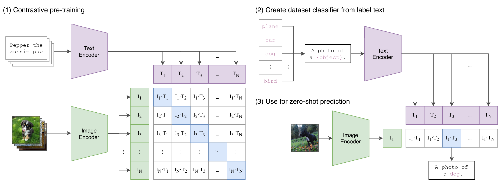
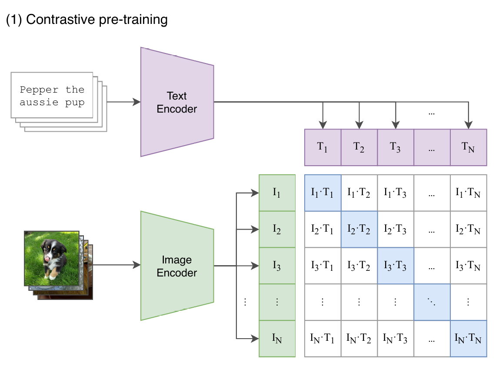
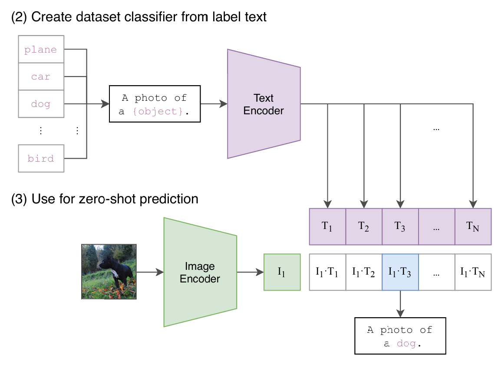

# mini-CLIP

[TOC]

## 1. CLIP模型整体结构

`CLIP`整体结构如下：



左边为预训练过程，进行对比训练，右边则为推理过程，计算余弦相似度，查找相似向量，下面进行详细的介绍。

### 1.1 训练数据

CLIP的训练数据是 `<图像，文本> pair`。如图所示，一个`batch`的数据里，有若干张图像，每张图像都配有相应的文字描述信息（prompt） ，比如：

一张小狗图片，`prompt`为`<dog> `，或者为`<A photo of a dog>`。

值得一提的是，CLIP的作者发现，`prompt`的设计也会影响模型最终的效果，比如：

+ 把`prompt`从单词`<dog>` 换成句子 `<A photo of a dog>` 后，模型在ImageNet分类任务上的准确率直接提高了`1.3%`。
+ 在OCR数据集上，作者发现如果把要识别的文字、数字用引号扩起来，能达到更好的效果。
+ 在卫星图分类数据集上，作者发现把`prompt`替换成`<A satellite photo of a house>` ，效果会更好。·
+ 在设计到多语义的场景，比如crane既可以表示仙鹤，又可以表示起重机。这时如果把`prompt`写成`<A photo of a crane, a type of pet>` ，就能解决歧义问题。

在论文的3.1.4部分，还有关于prompt工程的详细讨论，感兴趣的朋友，可以详读。

在训练中，CLIP没有用前人已经做好的“图像-文本”数据集，因为一来这些数据集质量不高，二来数量太少。CLIP团队自己动手，制作了一个含4亿“图像-文本“对的数据集。制作的方法是，首先从Wikipedia上取出出现次数在100以上的词制作成一个query list，然后保证其中每个query都有约2w个“图像-文本”对。

### 1.2 预训练：对比训练



CLIP模型由两个主体部分组成：`Text Encoder`和`Image Encoder`。这两部分可以分别理解成文本和图像的特征提取器。

对于`Text Encoder`，CLIP借鉴的是`GPT2`（[Radford et al.2019](https://cdn.openai.com/better-language-models/language_models_are_unsupervised_multitask_learners.pdf)）的架构。对于每条`promp`t，在进入`Text Encoder`前，都会添加表示开始和结束的符号`[SOS] `与`[EOS]` 。最终将最后一层`[EOS] `位置的向量作为该`prompt`的特征表示向量，也就是图中所绘的。

对于`Image Encoder`，CLIP则尝试过5种不同的ResNet架构和3种VIT架构，最终选用的是“ViTL/14@336px”这个模型，也就是架构为Large，`patch_size = 14`的ViT，同时在整个CLIP预训练结束后，用更高分辨率（336*336）的图片做了一个`epoch`的`fine-tune`，目的是让CLIP能涌现出更好的效果。与`Text Encoder`类似，每张图片对应一个最终特征表示向量。在读论文的过程中，我没有发现是来自于哪一出入层位置（也可能是我读漏了），但我猜测应该和`Text Encoder`差不多，可能来自分类头`[CLS]` 。

需要注意的是，CLIP是从头开始训练它的`Text Encoder`和`Image Encoder`的，没有借助其余预训练结果。

#### 对比学习

假设一个batch中共有N对`<图像，文字>`对，那么它们过完各自的`Encoder`后，就会分别产生：

- N条文字向量$[T_1,T_2,...,T_N]$
- N条图片向量$[I_1,I_2,...,I_N]$

这两组向量，将会分别过一次**多模态Embedding（multimodal embedding）** ，也就是在图中代表文字的紫色向量下，还有一层参数$W_t$（图中没有画出来），文字向量需要先和$W_t$做矩阵相乘后，才能得到最终的文字向量。对图片向量，同理也有个对应的$W_i$。$W_t$ ，$W_i$**的作用可以理解成把文字、图片特征投影到多模态的特征空间中去**。

经过多模态Emebdding的处理，我们得到了最终的$[T_1,T_2,...,T_N]$和$[I_1,I_2,...,I_N]$。接下来，**我们就能通过“对比学习”，找到图像和文字的相似关系**。做法也很简单，对于图中列出的$N*N$个格子，我们只需计算每个格子上对应的向量点积（余弦相似度）即可。由于对角线上的图片-文字对是真值，我们自然希望对角线上的相似度可以最大，据此我们可设置交叉熵函数，来求得每个`batch`下的`Loss`。

代码如下：

```
# image_encoder - ResNet or Vision Transformer
# text_encoder - CBOW or Text Transformer
# I[n, h, w, c] - minibatch of aligned images
# T[n, l] - minibatch of aligned texts
# W_i[d_i, d_e] - learned proj of image to embed
# W_t[d_t, d_e] - learned proj of text to embed
# t - learned temperature parameter
# extract feature representations of each modality

# -------------------------------------------------
# 1、图像/文字数据过image/text encoder，提取单模态特征
# 每张图片对应一个基本特征I_i
# 每张文字对应一个基本特征T_i
# -------------------------------------------------
I_f = image_encoder(I) #[n, d_i]
T_f = text_encoder(T) #[n, d_t]

# -------------------------------------------------
# 2. 图像/文字的基本特征过多模态Embedding，提取多模态特征
# 同时对这两个多模态特征做Layer Norm
# -------------------------------------------------
I_e = l2_normalize(np.dot(I_f, W_i), axis=1) # [n, d_i] * [d_i, d_e] = [n, d_e]
T_e = l2_normalize(np.dot(T_f, W_t), axis=1) # [n, d_t] * [d_t, d_e] = [n, d_e]

# -------------------------------------------------
# 3、计算图片-文字向量的余弦相似度
# -------------------------------------------------
logits = np.dot(I_e, T_e.T) * np.exp(t) # [n, n]

# -------------------------------------------------
# 4、计算Loss
# -------------------------------------------------
labels = np.arange(n)
loss_i = cross_entropy_loss(logits, labels, axis=0)
loss_t = cross_entropy_loss(logits, labels, axis=1)
loss = (loss_i + loss_t)/2
```

对最后一步计算Loss解释一下：

- CLIP分为**按行计算Loss**和**按列计算Loss**
- **按行计算Loss**，在每一行范围内做softmax，然后计算cross_entropy（蓝色格子部分是真值）。这样计算Loss的意义是：对于每一张图片，我们都希望找到和它最相似的文字。
- **按列计算Loss**，在每一列的范围内做softmax，然后计算cross_entropy（蓝色格子部分是真值）。这样计算Loss的意义是：对于每一段文字，我们都希望找到和它最相似的图片。
- **最后将这两个Loss相加取平均**，代表我们在模型优化过程中**考虑了“图片->文字”和“文字->图片”的双向关系**。

### 1.3 CLIP Zero-shot预测




当我们做完模型的预训练后，就能用模型来做之前说的zero-shot预测了，方法也非常简单：

- 首先，我们创建一个标签全集，如图中（2）所示，并得到每一个标签的特征向量
- 然后，我们取一张图片，如图中（3）所示，过Image Encoder后得到该图片的特征向量
- 最后，计算图片向量和文字向量间的相似度，取相似度最高的那条label即可。

代码实现如下：

```Python
import os
import clip
import torch
from torchvision.datasets import CIFAR100

# -------------------------------------------------
# 1、读取模型
# -------------------------------------------------
device = "cuda" if torch.cuda.is_available() else "cpu"
model, preprocess = clip.load('ViT-B/32', device)

# -------------------------------------------------
# 2、下载数据集
# -------------------------------------------------
cifar100 = CIFAR100(root=os.path.expanduser("~/.cache"), download=True, train=False)

# -------------------------------------------------
# 3、（1）从数据集中随机抽取一张图片，作为图片输入
#    （2）取出该数据集下所有的标签，作为文字数据
# -------------------------------------------------
image, class_id = cifar100[3637]
image_input = preprocess(image).unsqueeze(0).to(device)
text_inputs = torch.cat([clip.tokenize(f"a photo of a {c}") for c in cifar100.classes]).to(device)

# -------------------------------------------------
# 4、计算图像、文字的特征向量
# -------------------------------------------------
with torch.no_grad():
    image_features = model.encode_image(image_input)
    text_features = model.encode_text(text_inputs)

# -------------------------------------------------
# 5、分别对图像、文字特征向量做归一化处理，
#    然后计算余弦相似度
#    取最相似的top5结果
# -------------------------------------------------
image_features /= image_features.norm(dim=-1, keepdim=True)
text_features /= text_features.norm(dim=-1, keepdim=True)
similarity = (100.0 * image_features @ text_features.T).softmax(dim=-1)
values, indices = similarity[0].topk(5)

# -------------------------------------------------
# 6、打印结果
# -------------------------------------------------
print("\nTop predictions:\n")
for value, index in zip(values, indices):
    print(f"{cifar100.classes[index]:>16s}: {100 * value.item():.2f}%")
```

在读Zero-shot预测的代码中，你可能已经发现，对于标签来说，CLIP需要一个标签全集。也就是说，当你喂给CLIP一张图时，不管这张图片它是否有见过，CLIP都不会生成一个全新的标签，而是去全集标签中找一个最相似的给你（其实，这也是CLIP的缺陷之一，在论文的后面有做讨论）。借助这个代码，我们可以更好理解CLIP zero-shot的含义，也可以更好理解前文所说：只要训练数据集够大，模型总有办法做排除法的含义。

## 2. mini-CLIP实现

基于CIFAR10训练的CLIP模型，用作学习多模态模型

### 2.1 mini-CLIP结构

mini-CLIP的`Text Encoder`和`Image Encoder`结构如下：

- img_encoder采用resnet残差网络结构，简单输出image embedding.
- text_encoder采用三层transformer的encoder block，接收“A photo of a '[label]'”，在文本前面机上一个可训练的[cls]，最终将[cls]通过全连接输出text embedding.
- image embedding和text embedding做点积，得到logits，点积最大的(image,text)对最为相似.

### 2.2 训练

```
python train.py
```

### 2.3 推理

```
python inference.py
```

## Reference

1.[Learning Transferable Visual Models From Natural Language Supervision (arxiv.org)](https://arxiv.org/pdf/2103.00020)

2.CLIP模型整体结构部分-[CV大模型系列之：多模态经典之作CLIP](https://juejin.cn/post/7264503343996747830)

3.[mnist-clip](https://github.com/owenliang/mnist-clip)
